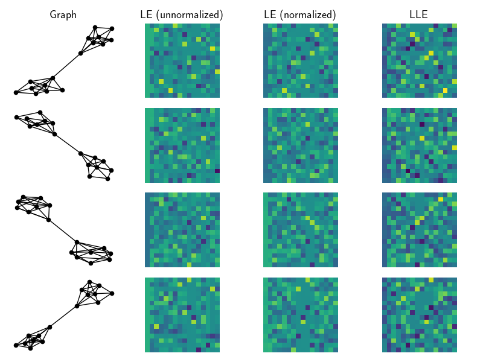

### Graph Embeddings

Last update: August 2019.

---

Numpy/CVXPY implementations of a few methods to embed the structure of a graph into its nodes. 
These methods assume access to only an adjacency matrix $A \in \{0,1\}^{n,n}$ and admit embeddings $X \in \mathbb{R}^{n,d}$; one for each node.

Note that each methods need to be permutation invariant, i.e.
$$
f(A) = f(P A P^\top), \text{ for all permutation matrices} P
$$

Each method returns embeddings $X$ such that, for each node $i$, $x^{(i)} \in \mathbb{R}^d$ satifies
$$||x^{(i)}||_2 = 1.$$

Moreover, for each feature $x_d \in \mathbb{R}^n$ in the dataset, we have
$$||x_d||_2 = 1.$$

So far we implement:

- Laplacian eigenmaps [1]. Both normalized and un-normalized versions.

- Locally linear embeddings [2]. We use the fixed adjacency matrix $A$ as weights.

- Structure-preserving embeddings [3]. Warning: implementation does not scale at all.

- Node2Vec [4]. Simple wrapper around Stanford's SNAP software.

Below we show an example of the embeddings for a community dataset on 18 nodes. Notice how prevalent the community structure is within the first two features of each embedding.

Note that in order to use Node2Vec you must install Stanford's SNAP software.

#### References

[1] Belkin, M., and Niyogi, P. (2003). Laplacian Eigenmaps for Dimensionality Reduction and Data Representation. Neural Computation 15, 1373–1396.

[2] Roweis, S.T., and Saul, L.K. (2000). Nonlinear Dimensionality Reduction by Locally Linear Embedding. Science 290, 2323–2326.

[3] Shaw, B., and Jebara, T. (2009). Structure Preserving Embedding. In Proceedings of the 26th Annual International Conference on Machine Learning, (New York, NY, USA: ACM), pp. 937–944.

[4] Grover, A., and Leskovec, J. (2016). Node2Vec: Scalable Feature Learning for Networks. In Proceedings of the 22nd ACM SIGKDD International Conference on Knowledge Discovery and Data Mining, (New York, NY, USA: ACM), pp. 855–864.

#### License

This code is available under the MIT License.

