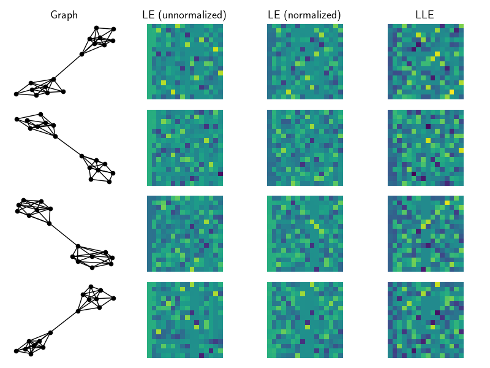

### Graph Embeddings

Last update: August 2019.

---

Numpy/CVXPY implementations of a few methods to embed the structure of a graph into its nodes. 
These methods assume access to only an adjacency matrix  and admit embeddings ; one for each node.

Note that each methods need to be permutation invariant, i.e.

So far we implement:

- Laplacian eigenmaps [1]. Both normalized and un-normalized versions.

- Locally linear embeddings [2]. We use the fixed adjacency matrix  as weights.

- Structure-preserving embeddings [3]. Warning: implementation does not scale at all.

Below we show an example of the embeddings for a community dataset on 18 nodes. Notice how prevalent the community structure is within the first two features of each embedding.

#### References

[1] Belkin, M., and Niyogi, P. (2003). Laplacian Eigenmaps for Dimensionality Reduction and Data Representation. Neural Computation 15, 1373–1396.

[2] Roweis, S.T., and Saul, L.K. (2000). Nonlinear Dimensionality Reduction by Locally Linear Embedding. Science 290, 2323–2326.

[3] Shaw, B., and Jebara, T. (2009). Structure Preserving Embedding. In Proceedings of the 26th Annual International Conference on Machine Learning, (New York, NY, USA: ACM), pp. 937–944.

#### License

This code is available under the MIT License.

